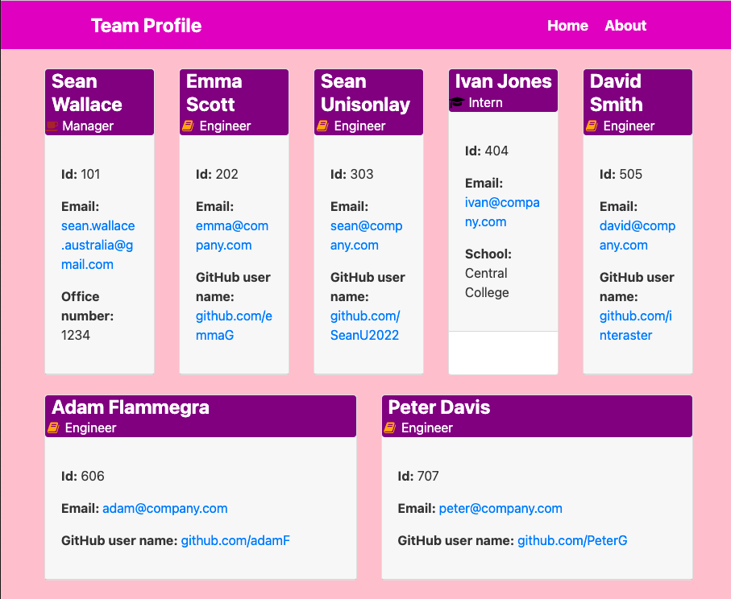

# Sean Wallace Team Profile HTML Generator
-----

## Description
A Node.js CLI Application using Inquirer to capture information about staff in a software engineering team that generates an HTML webpage displaying cards with summaries for each person.  Highlights include: OOP using inquirer, try/catch async calls, prompt/then/catch calls, template literals with HTML generation, recursion.  Unit tests with jest.

## Table of Contents

- [Installation](#installation)
- [Usage](#usage)
- [User Story](#user-story)
- [Acceptance Criteria](#acceptance-criteria)
- [Mock-Up](#mock-up)
- [Licence](#licence)
- [Contributing](#contributing)
- [Tests](#tests)
- [Reposoitory Information](#reposoitory-information)
- [Questions](#questions)

-----

## Installation
In project folder run this command: npm i inquirer@8.2.4
package.json dependencies: inquirer ^8.2.4 & jest ^24.9.0
package.json test scripts: jest
  
## Usage
run 'node index' and follow prompts
see **Tests** for the testing process

## User-Story

```
AS A manager
I WANT to generate a webpage that displays my team's basic info
SO THAT I have quick access to their emails and GitHub profiles
```
## Acceptance-Criteria

```
GIVEN a command-line application that accepts user input
WHEN I am prompted for my team members and their information
THEN an HTML file is generated that displays a nicely formatted team roster based on user input

1. WHEN I start the application
THEN I am prompted to enter the team manager’s name, employee ID, email address, and office number

2. WHEN I enter the team manager’s name, employee ID, email address, and office number
THEN I am presented with a menu with the option to add an engineer or an intern or to finish building my team

3. WHEN I select the engineer option
THEN I am prompted to enter the engineer’s name, ID, email, and GitHub username, and I am taken back to the menu

4. WHEN I select the intern option
THEN I am prompted to enter the intern’s name, ID, email, and school, and I am taken back to the menu

5. WHEN I decide to finish building my team
THEN I exit the application, and the HTML is generated

6a. WHEN I click on an email address in the HTML
THEN my default email program opens and populates the TO field of the email with the address

6b. WHEN I click on the GitHub username
THEN that GitHub profile opens in a new tab
```
-----

## Mock-Up

The following image shows a mock-up of the generated HTML’s appearance and functionality:



## Licence

MIT

 An explanation of the licence is here: https://opensource.org/licenses/MIT


## Contributing
  
contact creator for information

-----

## Tests

from project folder/"npm run test" to run the test suite

-----

## Reposoitory-Information
https://github.com/SeanU2022/Sean-Wallace-Team-Profile-HTML-Generator

Move the HTML file generated in ./dist folder before you overwrite it

## Questions

You can find out more at my GitHub account: <https://github.com/SeanU2022>

Please send any more questions you may have to: <sean.wallace.australia@gmail.com>
